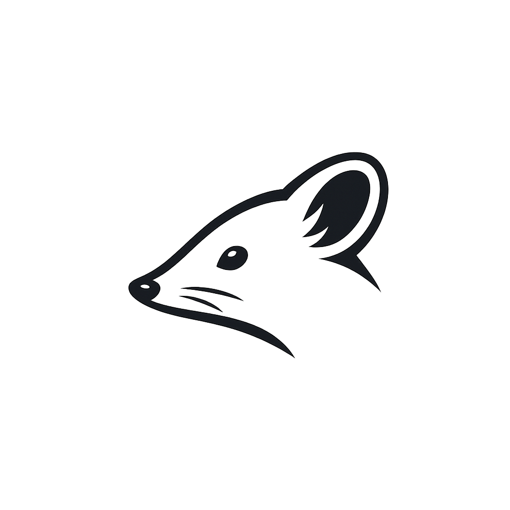

# Shrew: The Minimalist CLI Coding Agent



Shrew is a lightweight, zero-dependency command-line coding agent built in Go. It provides a seamless, agentic interface to your terminal, allowing Large Language Models to interact directly with your local environment to write code, run tests, and manage files.

Designed for portability and speed, Shrew is a single static binary. It requires no heavy runtimes like Node.js or Python, making it ideal for clean installations and restricted environments.

## Features

- Zero Dependencies: Built exclusively with the Go standard library.
- Multi-Provider Support: Native integration for Google Gemini, OpenAI, and Ollama.
- Future-Proof Architecture: Connect to any OpenAI-compatible API (DeepSeek, MiniMax, Groq) or custom external adapters.
- Agentic Execution: The model can execute shell commands via <run> tags to perform real-world tasks.
- Skills System: Extend the agent's capabilities by adding Markdown-based instructions to the skills directory.
- Local Context: Automatically gathers context from your current working directory.
- Instant Startup: Millisecond boot times for a responsive CLI experience.

## Installation

### From Source (Recommended)
Building from source ensures you have the latest features and optimizations for your architecture.

```bash
git clone https://github.com/Masmedeam/shrew.git
cd shrew
go build -o shrew main.go
sudo mv shrew /usr/local/bin/
```

### Go Install
If you have Go installed and configured on your path:

```bash
go install github.com/Masmedeam/shrew@latest
```

### Debian / Ubuntu
For Debian-based systems, you can install the .deb package if available:

```bash
sudo apt install ./shrew.deb
```

## Configuration

Configure Shrew by creating a .env file in your project root or setting environment variables.

### Google Gemini (Default)
```bash
GEMINI_API_KEY=your_api_key
```

### OpenAI Compatible (DeepSeek, MiniMax, etc.)
```bash
SHREW_PROVIDER=openai
OPENAI_API_KEY=your_api_key
SHREW_API_URL=https://api.example.com/v1/chat/completions
SHREW_MODEL=model-name
```

### Ollama (Local)
```bash
SHREW_PROVIDER=ollama
SHREW_MODEL=qwen2.5-coder:7b
```

## Skills System

Shrew uses a "Skills" architecture to learn specialized workflows. Any Markdown file placed in the `./skills/` directory is automatically loaded and appended to the system instructions at startup.

Example skills:
- git_workflow.md: Teaches the agent how to manage commits and branches.
- api_explorer.md: Instructs the agent on how to use curl to interact with unknown APIs.

## Usage

Start the interactive session:

```bash
shrew
```

Once started, you can issue high-level instructions:
- "Initialize a new Go project and write a basic HTTP server."
- "Refactor the current directory to use a cleaner package structure."
- "Find all TODOs in the codebase and implement them."

The agent will propose and execute shell commands using `<run>command</run>`. It will process the output and continue until the task is complete.

## Safety and YOLO Mode

By default, Shrew executes proposed commands immediately via bash. This allows for powerful automation but requires caution. Always ensure you are running Shrew in a directory where you trust the potential modifications.

## License

This project is licensed under the MIT License. See the LICENSE file for details.
