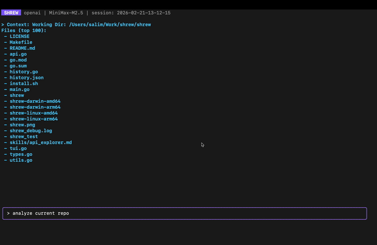

<div align="center">
  
  <br>
  
</div>

# Shrew: Ultra-lightweight Agent

Shrew is a powerful, zero-dependency AI agent that connects to any API through its skills paradigm and automates your command line. It's a single static binary written in Go that is configuration-oriented, making it more extensible and trustable without the need to update its code. Shrew gives AI models a rich, interactive terminal to perform real-world tasks.

## Philosophy

- **Lightweight & Fast**: A single static binary written in Go with minimal dependencies, ensuring maximum portability and performance.
- **Model Agnostic**: Connect to any model provider in the cloud (Gemini, OpenAI, Anthropic, etc.) or run locally using Ollama.
- **Agentic Execution**: The model can execute shell commands directly in your terminal via `<run>` tags, allowing it to write code, manage files, and run tests.
- **Hackable & Extensible**: Designed with a clean, easy-to-understand codebase so it can be easily forked, modified, and extended with new skills.
- **Extensible Skills System**: Teach Shrew new workflows and give it long-term knowledge by adding simple Markdown files to the `skills/` directory.

## Installation

The easiest way to install Shrew on a new machine is with the one-command installer. This script will automatically detect your OS and architecture, download the latest binary from GitHub Releases, and install it.

```bash
curl -fsSL https://raw.githubusercontent.com/Masmedeam/shrew/main/install.sh | sh
```

## Usage

Simply run the agent to start an interactive session:
```bash
shrew
```
You can then issue high-level instructions, and Shrew will use its skills, tools, and reasoning to accomplish the task.

### Other Installation Methods

#### From Source
```bash
git clone https://github.com/Masmedeam/shrew.git
cd shrew
go build -o shrew main.go
sudo mv shrew /usr/local/bin/
```

#### Go Install
```bash
go install github.com/Masmedeam/shrew@latest
```

## Configuration

Configure Shrew by creating a `.env` file in your project root or by setting environment variables.

### OpenAI or any Compatible API
Use this for providers like DeepSeek, MiniMax, Groq, etc.
```bash
SHREW_PROVIDER=openai
OPENAI_API_KEY=your_api_key
SHREW_API_URL=https://api.example.com/v1/chat/completions # The provider's URL
SHREW_MODEL=model-name
```

## License

This project is licensed under the MIT License. See the LICENSE file for details.
